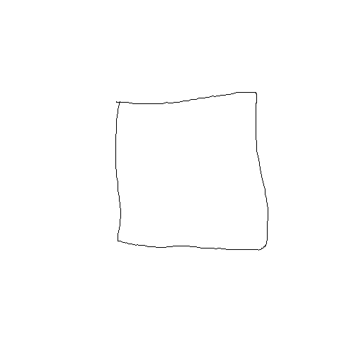
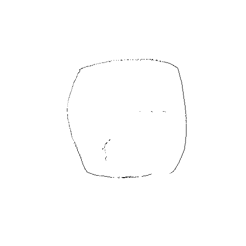
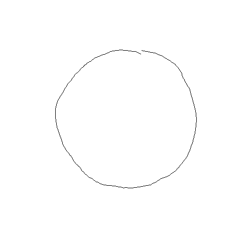
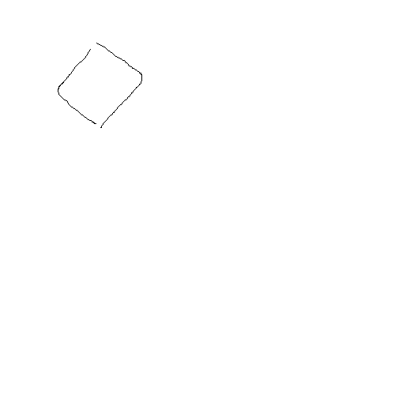

# gif-generator

## Description

A gif generator with interpolation and user interface
The frames are drawn and positioned on a timeline by the user

## Setup

All code is implemented in python

Libraries needed :
- user interface : tkinter
- image management : PIL
- gif generation : glob, os
- interpolation : PIL, numpy, os, matplotlib

`gif_generator.py` launchs the user interface and fabrics `output.gif` with the images in `gif/`
`interpolation.py` computs an intermediate image `intermed.png` with the ones in `interpolation/`
`iterative_closest` pics `imageA.png` in `ITC/`, translates and rotates it to create a virtual `imageB` and then finds back automatically the translation and rotation matrix from the two pictures positions

## Results

Automatically generated transition picture from a square to a circle

  
  
  

Interpolated gif with only 4 drawn frames

  

